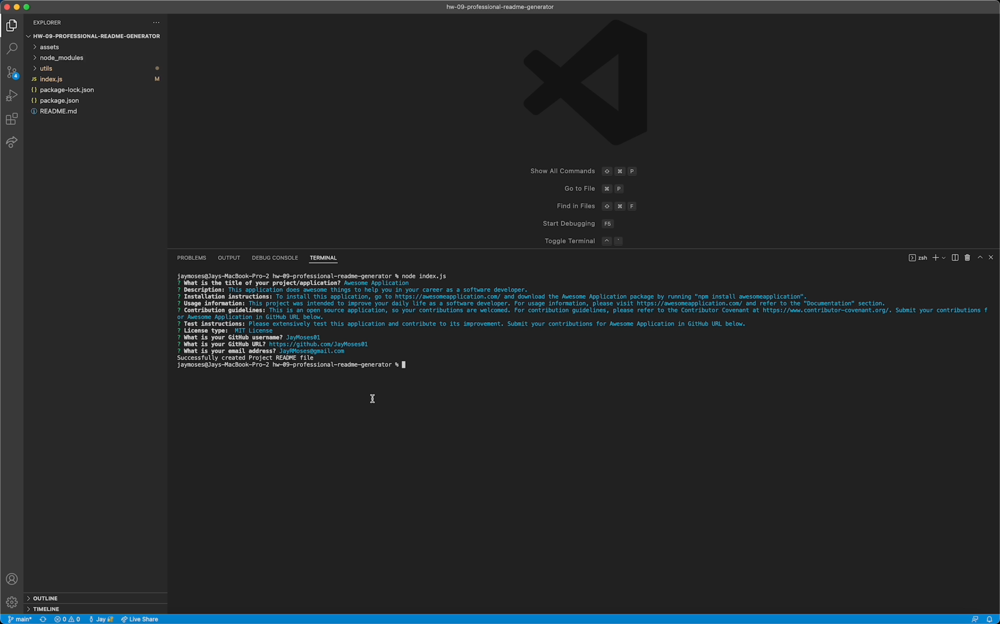
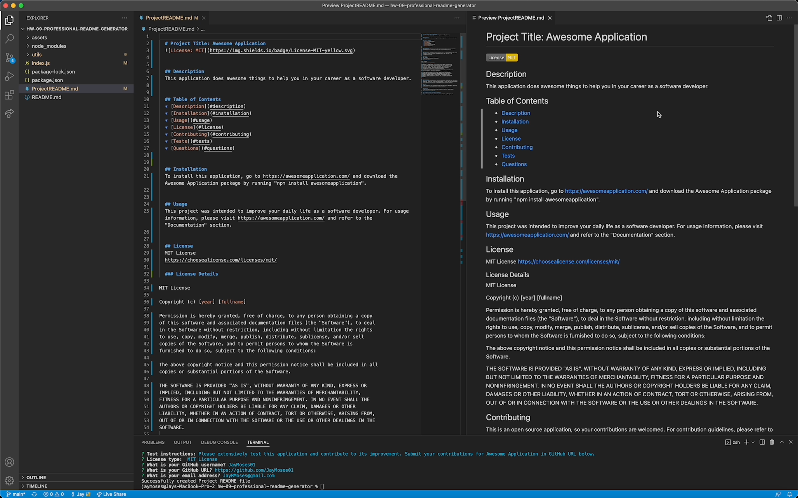

# Homework 09: Professional README Generator

## Description

I created a README Markdown file generator with this functionality:

* Upon running "node index.js" in the command line, the user is prompted for information necessary for generating their README file.
* The following sections will generate containing the user's input:
    * Description
    * Table of Contents
    * Installation
    * Usage
    * License
    * Contributing
    * Tests
    * Questions
* The license that the user selects determines the license badge that displays towards the top of the generated README file, and it also determines the license-related legal text that is populated in the "License" section.
* The user is prompted to enter their GitHub username, GitHub profile URL, and email address. This information is added to the "Questions" section with instructions on how to reach the user with questions.
* The generated README file also contains a functional Table of Contents with links that allow a user to navigate directly to their desired section by clicking on the respective section link.

## Screenshots of the application

## Application walkthrough video demo

A video demonstrating the functionality of this application can be found at the URL below.

URL of walkthrough video demo: https://drive.google.com/file/d/1dyFasqMFypiMXEk0OxTjtdglCI0WBf5B/view?usp=sharing

## Sample generated README file

A sample generated README file can be viewed in assets > ProjectREADME.md or by clicking here: 

## Technologies used

This application utilizes these technologies:

* Node.js
* Markdown

## Contact information

* Website: https://jaymoses01.github.io/hw-08-updated-portfolio-page/
* Email: JayRMoses@gmail.com

## MIT license

Permission is hereby granted, free of charge, to any person obtaining a copy
of this software and associated documentation files (the "Software"), to deal
in the Software without restriction, including without limitation the rights
to use, copy, modify, merge, publish, distribute, sublicense, and/or sell
copies of the Software, and to permit persons to whom the Software is
furnished to do so, subject to the following conditions:

The above copyright notice and this permission notice shall be included in all
copies or substantial portions of the Software.

THE SOFTWARE IS PROVIDED "AS IS", WITHOUT WARRANTY OF ANY KIND, EXPRESS OR
IMPLIED, INCLUDING BUT NOT LIMITED TO THE WARRANTIES OF MERCHANTABILITY,
FITNESS FOR A PARTICULAR PURPOSE AND NONINFRINGEMENT. IN NO EVENT SHALL THE
AUTHORS OR COPYRIGHT HOLDERS BE LIABLE FOR ANY CLAIM, DAMAGES OR OTHER
LIABILITY, WHETHER IN AN ACTION OF CONTRACT, TORT OR OTHERWISE, ARISING FROM,
OUT OF OR IN CONNECTION WITH THE SOFTWARE OR THE USE OR OTHER DEALINGS IN THE
SOFTWARE.
